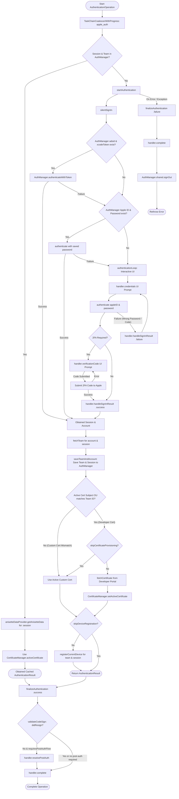

#### DESIGN DOCUMENTATION

1. Authentication:

```mermaid
graph TD
    Start([Start AuthenticationOperation]) --> Coalesce[TaskChainCoalescerWithProgress: apple_auth]
    Coalesce --> CheckL1Cache{Session & Team in AuthManager?}

    %% Fast Path (In-Memory Cached Session & Team)
    CheckL1Cache -- Yes --> FetchAnisette[anisetteDataProvider.getAnisetteData for: session]
    FetchAnisette --> GetActiveCert[Use CertificateManager.activeCertificate]
    GetActiveCert --> ReturnCachedResult([Obtained Cached AuthenticationResult])

    %% Full Auth Path (startAuthentication)
    CheckL1Cache -- No --> StartAuth[startAuthentication]

    %% Step 1: Silent Sign-In Attempts
    StartAuth --> SilentAuth[silentSignIn]
    SilentAuth --> CheckTokens{AuthManager adsid & xcodeToken exist?}

    CheckTokens -- Yes --> TokenAuth[AuthManager.authenticateWithToken]
    TokenAuth -- Success --> GotSession[Obtained Session & Account]
    TokenAuth -- Failure --> CheckPassword

    CheckTokens -- No --> CheckPassword{AuthManager Apple ID & Password exist?}
    CheckPassword -- Yes --> PasswordAuth[authenticate with saved password]
    PasswordAuth -- Success --> GotSession
    PasswordAuth -- Failure --> AuthLoop

    CheckPassword -- No --> AuthLoop[authenticationLoop: Interactive UI]

    %% Interactive Loop (UI Credentials + 2FA)
    AuthLoop --> RequestCreds[handler.credentials UI Prompt]
    RequestCreds --> CallAuth[authenticate appleID & password]

    CallAuth --> TwoFactorCheck{2FA Required?}
    TwoFactorCheck -- Yes --> Prompt2FA[handler.verificationCode UI Prompt]
    Prompt2FA -- Code Submitted --> Submit2FA[Submit 2FA Code to Apple]
    Submit2FA -- Success --> NotifyUI[handler.handleSignInResult .success]
    Submit2FA -- Error --> Prompt2FA

    TwoFactorCheck -- No --> NotifyUI
    NotifyUI --> GotSession

    CallAuth -- "Failure (Wrong Password / Code)" --> NotifyError[handler.handleSignInResult .failure]
    NotifyError --> RequestCreds

    %% Step 2 & 3: Team Resolution & Certificate Provisioning
    GotSession --> FetchTeam[fetchTeam for account & session]
    FetchTeam --> SaveState[saveTeamAndAccount: Save Team & Session to AuthManager]

    SaveState --> CheckCustomCert{Active Cert Subject OU matches Team ID?}

    CheckCustomCert -- "No (Custom Cert Mismatch)" --> ReuseCert[Use Active Custom Cert]
    CheckCustomCert -- "Yes (Developer Cert)" --> CheckSkipCert{skipCertificateProvisioning?}

    CheckSkipCert -- Yes --> ReuseCert
    CheckSkipCert -- No --> FetchCert[fetchCertificate from Developer Portal]
    FetchCert --> SaveActiveCert[CertificateManager.setActiveCertificate]

    %% Step 4: Device Registration
    ReuseCert --> CheckSkipReg{skipDeviceRegistration?}
    SaveActiveCert --> CheckSkipReg
    CheckSkipReg -- No --> RegisterDevice[registerCurrentDevice for team & session]
    CheckSkipReg -- Yes --> ReturnAuthResult([Return AuthenticationResult])
    RegisterDevice --> ReturnAuthResult

    %% Finalize & Error Recovery (Both Paths)
    ReturnCachedResult --> FinalizeSuccess[finalizeAuthentication .success]
    ReturnAuthResult --> FinalizeSuccess

    StartAuth -- "On Error / Exception" --> FinalizeFailure[finalizeAuthentication .failure]
    FinalizeSuccess --> CodeSignCheck{validateCodeSign: didResign?}
    CodeSignCheck -- "No & requiresPostAuthFlow" --> ResolvePostAuth[handler.resolvePostAuth]
    CodeSignCheck -- "Yes or no post-auth required" --> CompleteHandler[handler.complete]
    ResolvePostAuth --> CompleteHandler
    CompleteHandler --> EndAuth([Complete Operation])

    FinalizeFailure --> CompleteFailure[handler.complete]
    CompleteFailure --> SignOutCleanup[AuthManager.shared.signOut]
    SignOutCleanup --> ThrowError([Rethrow Error])
```
